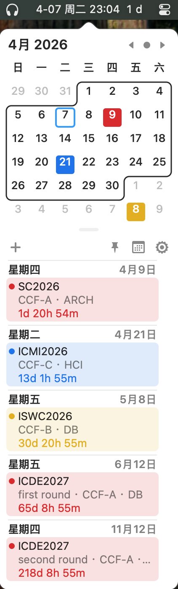
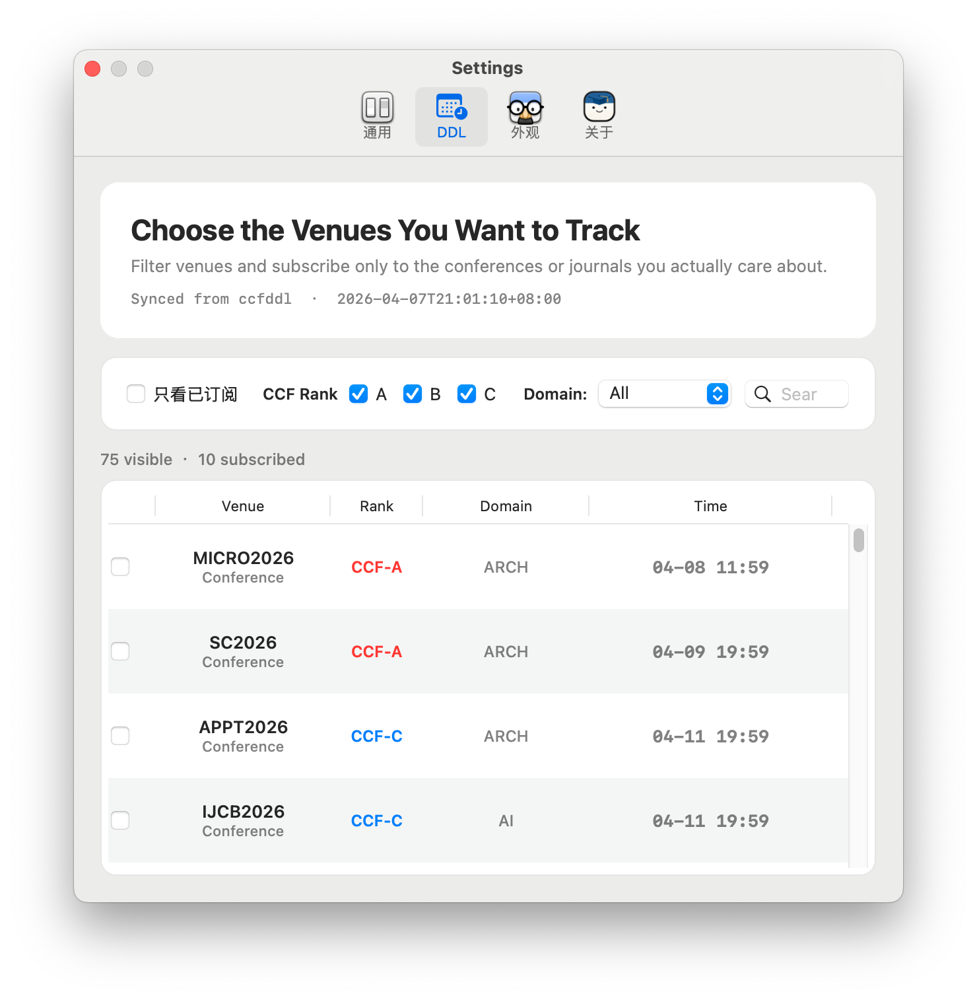

<p align="center">
  
</p>

# CCFCal: 桌面版 ccfddl，你的 macOS 顶会倒计时工具


🔥 **一款常驻 macOS 菜单栏的桌面版 ccfddl。**

CCFCal 是一款专为 macOS 菜单栏设计的倒计时工具。它将开源项目 `ccfddl` 的会议截稿数据直接集成到了系统中，让你无需每次都打开浏览器访问网页，在桌面菜单栏即可直接查看关注的顶会 DDL。

只需在应用内筛选并订阅相关的会议（例如 ACL, ICLR, AAAI 等），最近的一个截稿倒计时就会自动显示在系统的右上角。


<p align="center">
  
</p>

## ✨ 核心功能

- 🚨 **菜单栏倒计时**：在系统右上角直观显示距离最近一个已订阅 DDL 的剩余时间（例如 `8 d`, `3 h` 或 `24 m`）。
- 🎯 **分类筛选与订阅**：内置基于开源生态 `ccfddl` 的最新数据。支持按 `CCF-A / B / C`、细分领域及关键词进行检索，只订阅你真正打算投递的会议。
- 📅 **独立日历同步**：订阅的会议会自动同步到 macOS 的原生日历中。CCFCal 会在本地创建一个名为 `DDLCal Subscriptions` 的专属日历，**绝对不会写入或修改你的个人私人日程**。
- 🔦 **日历视图高亮**：点击菜单栏图标即可唤出极简日历面板，所有已订阅的截稿节点都会在日历上清晰高亮。


<p align="center">
  
</p>

## 🚀 快速安装

1. 前往  页面下载最新的 `CCFCal-1.0.1.dmg`。
2. 双击打开 `dmg`，将其中的 `CCFCal.app` 拖拽到同一窗口里的 `Applications`（应用程序）快捷方式中。
3. 打开“应用程序”文件夹，找到 `CCFCal.app`，右键点击并选择**打开**，在弹窗中再次确认**打开**。
4. 首次启动时，系统会弹出日历权限请求，请点击**允许授予权限**以便正常显示日历事件。

> 💡 **安装提示**
>
> - **系统要求**：macOS 11.0 或更高版本。
> - 当前发布包未经过 Apple Developer ID 签名与公证。如果 macOS 提示“`CCFCal.app` 已损坏无法打开”，请先确认它已经移入“应用程序”文件夹，然后打开“终端”执行以下两行命令即可正常打开：
>
> ```bash
> xattr -dr com.apple.quarantine /Applications/CCFCal.app 
> open /Applications/CCFCal.app
> ```
>
> 

## 🔐 权限与隐私说明

CCFCal 仅需要“日历”权限来展示系统事件，并将你订阅的 DDL 写入专属的本地日历中。**应用不会读取、收集或修改你的任何私人日历数据。** *(设置路径：系统设置 -> 隐私与安全性 -> 日历 -> 勾选 CCFCal)*

## 🔄 数据更新机制

- **自动获取**：应用每次启动时会自动检查云端最新 DDL 数据，并在后台每天最多静默刷新一次。
- **离线缓存**：数据快照由本仓库的 `docs/DDLCandidates.json` 托管并在本地生成缓存，无网络连接时也能正常查看已加载的数据。
- **手动更新**：当前 v1.0.1 暂不包含 App 本体的自动更新模块。DDL 数据会自动刷新，但如果 App 修复了 Bug 或推出了新功能，请关注本仓库的 Releases 页面手动下载替换。

## 📚 数据来源声明

应用内的 DDL 基础数据源自优秀的开源生态 。 *注意：会议和期刊的官方截稿时间可能会发生临时延期或变更。在最终提交论文前，请务必以各会议/期刊官方网站的通告为准。*

## 🤝 致谢与开源许可

- **核心框架**：CCFCal 基于  进行二次开发。Itsycal 是由 Sanjay Madan 开发的一款极简 macOS 菜单栏日历（基于 MIT 许可）。原始许可文本保留在 `CCFCal/LICENSE.txt` 中。
- **开源协议**：CCFCal 的修改与新增代码部分遵循 `MIT License` 并在根目录 `LICENSE` 中发布。
- **第三方组件**：涉及的第三方框架与数据源详细说明，请参阅 `NOTICE.md`。

欢迎查阅 `CONTRIBUTING.md` 获取本地编译与贡献指南，如果你觉得这个小工具对你有帮助，欢迎点个 **Star ⭐️** 支持！
