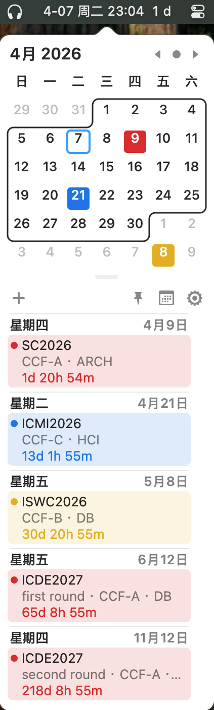
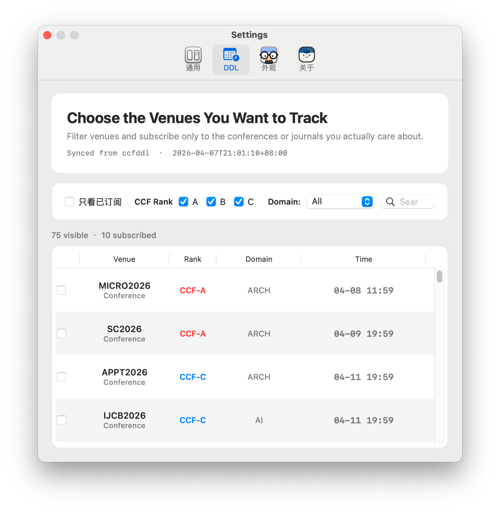

<p align="center">
  
</p>

<h1 align="center">CCFCal</h1>

<p align="center">
  <strong>把 CS / AI 会议截稿倒计时放进 macOS 菜单栏</strong><br>
  选定目标会议，随时看到距离 DDL 还有多久。
</p>

<p align="center">
  <a href="https://github.com/Good-Way-ZJU/CCFCal/releases/latest"></a>
  
  
  <a href="LICENSE"></a>
</p>

## 不再反复打开网页查看 DDL

CCFCal 是一款面向计算机科学与人工智能研究者的 macOS 菜单栏倒计时工具。

在应用中选择 AAAI、ACL、ICLR 等目标会议后，菜单栏会直接显示会议简称和剩余时间，例如 `AAAI 12d`。选择多个会议时，CCFCal 自动展示最先到来的截稿节点，让最近的目标始终保持可见。

它不试图替代会议官网，也不增加复杂的任务管理流程。CCFCal 只专注一件事：让你每次看向菜单栏时，都知道距离目标会议还有多久。

<p align="center">
  
</p>

## 核心功能

- **菜单栏目标倒计时**：以 `会议简称 + 剩余时间` 的形式显示最近 DDL，例如 `ACL 3d`、`ICLR 8h`。
- **覆盖 CS / AI 主要研究方向**：包括人工智能、数据库、计算机体系结构、网络与系统、安全、软件工程、人机交互和计算机图形学等领域。
- **CCF 分类筛选**：支持 `CCF-A / B / C / NONE`，也可按研究方向或关键词快速查找会议。
- **多个目标统一追踪**：可同时关注多个会议；菜单栏优先显示最近的 DDL，日历面板中集中查看后续节点。
- **macOS 原生日历同步**：在本机创建独立的 `DDLCal Subscriptions` 日历，用于同步已选择会议的截稿时间。
- **日历高亮与议程视图**：在月历中标记目标 DDL，并在议程区域查看即将到来的截稿节点。
- **自动更新会议数据**：启动时检查托管的数据快照，每天至多刷新一次；离线时继续使用本地数据。

<p align="center">
  
</p>

## 覆盖方向

CCFCal 的会议数据来自 [ccfddl](https://ccfddl.github.io/) 开源生态，当前支持以下主要方向：

| 方向 | 包含领域示例 |
| --- | --- |
| AI | 人工智能、机器学习、自然语言处理、计算机视觉 |
| DB | 数据库、数据挖掘与信息检索 |
| ARCH | 计算机体系结构与高性能计算 |
| SYS | 操作系统、分布式系统与存储系统 |
| NET | 计算机网络与移动计算 |
| SEC | 网络安全、隐私与密码学 |
| SE | 软件工程与程序设计语言 |
| HCI | 人机交互与普适计算 |
| CG | 计算机图形学与多媒体 |

会议等级来自 CCF 分类；未列入 CCF-A/B/C、但数据源中可追踪的会议会显示为 `CCF-NONE`。

## 安装

1. 前往 [Releases](https://github.com/Good-Way-ZJU/CCFCal/releases/latest) 下载最新版本。
2. 打开下载的安装包，将 `CCFCal.app` 拖入“应用程序”文件夹。
3. 首次运行时授予日历访问权限。

当前发布包如果尚未经过 Apple Developer ID 签名与公证，macOS 可能阻止首次打开。请确认应用来自本仓库的 Releases 页面，然后在终端执行：

```bash
xattr -dr com.apple.quarantine /Applications/CCFCal.app
open /Applications/CCFCal.app
```

系统要求：macOS 11.0 或更高版本。

## 使用方法

1. 启动 CCFCal，点击菜单栏图标打开日历。
2. 进入“设置 → DDL”。
3. 按 CCF 等级、研究方向或关键词筛选会议。
4. 勾选你的目标会议。
5. 菜单栏会立即显示最近目标的简称与剩余时间。

如果选择了多个会议，菜单栏显示最先截止的一个；完整列表可在 CCFCal 的日历与议程视图中查看。

## 数据更新与准确性

- App 内置一份可离线使用的会议数据快照。
- 联网启动时会检查本仓库托管的最新快照，并在后台更新。
- 数据生成与适配脚本位于 [`pipeline/`](pipeline/)，发布快照位于 [`docs/DDLCandidates.json`](docs/DDLCandidates.json)。

会议截稿时间可能临时调整。CCFCal 适合用于日常追踪和提醒，但投稿前请务必以会议官方网站公布的时间和时区为准。

## 隐私

CCFCal 使用 macOS 日历权限来展示本机日程，并将目标会议 DDL 写入独立日历。日历数据只在本机用于展示和同步，不会上传到 CCFCal 的服务器；DDL 同步只管理 `DDLCal Subscriptions`，不会改写你其他日历中的事件。

你可以随时在“系统设置 → 隐私与安全性 → 日历”中关闭权限。

## 本地构建

```bash
git clone https://github.com/Good-Way-ZJU/CCFCal.git
cd CCFCal
cp CCFCal/Local.xcconfig.example CCFCal/Local.xcconfig
open CCFCal/CCFCal.xcodeproj
```

数据管道测试：

```bash
python3 -m unittest discover -s pipeline/tests
```

更多开发与发布说明请参阅 [CONTRIBUTING.md](CONTRIBUTING.md)。

## 数据来源与致谢

- 截稿数据：[ccfddl](https://ccfddl.github.io/) / ccf4sc 风格数据生态
- 上游应用：[Itsycal](https://github.com/sfsam/Itsycal)，由 Sanjay Madan 开发，基于 MIT License
- 自动更新框架：[Sparkle](https://github.com/sparkle-project/Sparkle)
- 快捷键框架：[MASShortcut](https://github.com/cocoabits/MASShortcut)

第三方组件与许可证详情见 [NOTICE.md](NOTICE.md)。CCFCal 自有修改部分基于 [MIT License](LICENSE) 开源。

如果 CCFCal 对你的投稿节奏有帮助，欢迎提交 Issue、参与改进，或点一个 Star。
